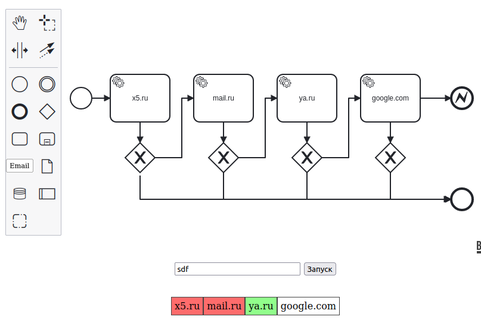

# CHAIN MAIL SENDER

## Запуск
Для запуска необходимо выполнить команды
```
npm install
npm run start 
```

## Краткое описание
- Предполагается, что стоит задача по отправке письма на указанное имя пользователя. При этому могут быть предоставлены несколько доменных имён. Первая отправка на один из предоставленных доменов прерывает цепочку и скрипт считается выполненным успешно.

## Допущения
- Сервер на каждый запрос отвечает с вероятностью в 50% статусом 200 и с вероятностью 50% статусом 400. При ответе со статусом 200 блок домена подсвечивается зелёным, при ответе со статусом 400 блок домена подсвечивается красным.
- Зелёная подсветка сигнализирует о удачной отправке письма и завершает выполнение цепочки.
- Правила бизнес логики (например, выдача ошибки при вводе строки не являющейся доменом); наличие связей между элементами, обозначающими задачи (будет работать и без связей между блоками в редактор), создание кастомного рендера для кастомной кнопки - не реализовано, с целью упрощения логики
- Также, с целью упрощения, не реализовано построение дерева на базе сгенерированной XML диаграммы с обходом дерева для построения интерфейса. Вместо обхода дерева использовалось регулярное выражение, для поиска ID задачи в XML, с целью проверки, не было ли удаления элемента из редактора.
- Также, с целью упрощения, не реализовано обработка изменения содержимого элементов в редакторе.

## Порядок работы.
- С помощью кнопки Email создаем элементы на диаграмме.
- Редактируем имя элементов. Если в качестве имени элемента указан домен - то в нижней части экрана для этого домена генерируется блок, являющийся GUI представлением домена. Если в качестве имени элемента указан не домен - блок игнорируется.
- После создания нужного количества доменных сущностей необходимо вписать целевое имя в поле ввода
- После нажатия на кнопку Запуск происходит последовательная отправка на сервер запросов с указанным доменом. На какой-то из доменов придёт положительный ответ и отправка остановится. (А может и не придёт)



## TODO
- [ ] При правильном подходе редактор должен быть изолированной страницей. При редактировании документа изменения должны отправляться на сервер и сохраняться. Для удобства разработки на JS/TS, файл, перед сохранением, можно транслировать из формата XML в формат JSON. В последующем указанный файл должен использоваться и бэком и фронтом для формирования корректных бизнес-правил и бизнес-процессов.
- [ ] Бизнес-модели должны содержать описание бизнес-правил и описание ошибок, генерирующихся при несоблюдении правил. Также правила должны включать проверку наличия связей между элементами. Т.е. правильнее было бы строить дерево графов на базе указанной bpmn-схемы и в бизнес-правила включать проверки на корректность связей (например, что в дереве есть блок завершающий выполнение и он связан другим блоком). Также на базе дерева можно построить валидатор, который может проверять тупиковые ветки на сложных схемах и показывать какая ветка тупиковая
- [ ] Необходимо предусмотреть версионирование bpmn-схемы в системе хранения файла, с целью уменьшения вероятности неконсистентных данных в БД и в моделях. К примеру в БД хранятся данные о имени и возрасте пользователя, а в модель была добавлена колонка о поле. При безусловном использовании фронтом bpmn-схемы с бэка, возможны ошибки, т.к. у каких-то пользователей этого поля может и не появится.
